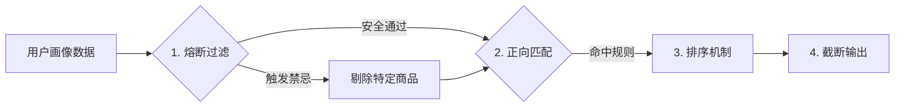

# 推荐策略中心 PRD (Product Requirement Document)

> **版本**：V1.2  
> **更新日期**：2026-02-01  
> **状态**：编写中  
> **配套原型**：[3-推荐配置中心.html]

---

## 1. 模块概览

### 1.1 核心价值
提供"人货匹配"的决策大脑配置工具。运营人员可以在此配置推荐规则，系统根据用户画像（元数据）自动匹配最合适的商品（SKU）。

### 1.2 适用角色
- **商品运营**：配置推荐规则、撰写推荐文案。
- **系统管理员**：管理策略版本、发布上线。

### 1.3 上下游关系
- **上游 - 元数据字典**：提供用户标签（原始指标、问卷标签、衍生标签）作为筛选条件。
- **上游 - 商品管理中心**：提供产品系列（SPU）和**推荐匹配属性**（SKU属性）。
- **下游 - H5报告**：展示推荐理由（SAY）和推荐商品列表（DO）。

---

## 2. 核心概念与逻辑

### 2.1 策略包 (Strategy Package)
针对某一特定品类（如枕头、床垫）的完整推荐规则集合。

**规则**：
- **单例模式**：同一品类在同一时间只能有一个生效（Online）的策略包。
- **版本覆盖**：发布新策略时，若该品类已有生效策略，新策略将自动覆盖旧策略，旧策略归档为历史版本。

### 2.2 匹配计算模型（四步漏斗）

当用户完成体测后，系统按以下顺序执行推荐计算：

#### 第一步：熔断过滤 (Fuse Breaker) —— 最高优先级
- **目的**：确保用户健康安全，绝对禁止推荐禁忌商品。
- **逻辑**：`IF 用户命中[禁忌标签] THEN 强制剔除[特定属性]商品`
- **示例**：用户有`乳胶过敏`标签 → 排除所有 `材质 = 天然乳胶` 的 SKU。

#### 第二步：正向匹配 (Positive Matching)
- **目的**：精准匹配适合用户的商品系列和规格。
- **执行逻辑**：
    1. 按规则优先级（列表顺序）依次匹配。
    2. 每条规则包含两级筛选：
       - **L1 系列锁定**：先圈定推荐哪个产品系列（如"深睡护脊枕系列"）。
       - **L2 属性筛选**：在该系列内，进一步筛选符合条件的 SKU。
- **冲突处理**：
    - **同一属性冲突**：高优先级规则的属性值覆盖低优先级。
    - **不同属性叠加**：属性条件取并集。

#### 第三步：排序机制 (Waterfall)
- **瀑布流逻辑**：
    1. 系统按照**运营配置的规则顺序**（Rule 1 > Rule 2...）依次运行。
    2. **Rule 1 命中**：该规则产生的商品，排在结果列表的**最前方**。
    3. **Rule 2 命中**：其结果排在 Rule 1 的结果**之后**。
    4. **规则内排序**：若单条规则输出了多个商品，默认按商品上架时间倒序排列。

#### 第四步：截断输出 (Top N)
- 截取前 N 个结果输出。
- **缺货/下架处理**：系统仅推荐状态为**“上架”**的 SKU。若命中商品已下架，则自动跳过该商品，尝试推荐列表中的下一个商品。
- **兜底机制**：若有效结果不足 N 个，触发兜底策略补齐。

### 2.3 兜底策略 (Fallback Strategy)
- **定义**：当所有匹配规则都未命中，或命中商品均不可用时的默认行为。
- **V1 方案**：**指定单一 SKU** 作为兜底（通常配置为全能型爆款）。

---

## 3. 功能详细设计

### 3.1 策略列表页
- **筛选**：支持按状态筛选（全部 / 生效中 / 草稿 / 历史版本）。
- **展示**：策略名称、关联品类、当前状态、最后修改时间。
- **操作**：
    - **新建**：打开新建向导。
    - **编辑**：Draft 状态可直接编辑；Online 状态需创建副本编辑。
    - **删除**：仅 Draft 和 History 状态可删除。
    - **查看历史**：点击可查看该品类的历史版本列表。

### 3.2 新建策略向导
分两步完成策略初始化：
1. **基础信息**：填写策略名称、描述。
2. **选择品类**：**核心约束**。一旦创建，品类不可修改（因为规则依赖特定品类的属性模板）。

### 3.3 策略详情配置页

#### A. 全局设置
- **Top N**：设置最终透出的商品数量（1-10）。
- **兜底策略**：指定单一 SKU 作为兜底。
- **排序偏好**：
    - **匹配度优先**（默认）：严格按照规则匹配程度排序。
    - **热度优先**：在命中规则的商品中，优先展示销量高的。

#### B. 熔断规则配置 (红色区域)
- **触发条件**：多选用户标签（OR 关系）。
- **排除对象**：选择要排除的**推荐匹配属性**（如 材质=乳胶）。

#### C. 匹配规则配置 (蓝色区域)
支持拖拽排序调整优先级。每条规则包含：
- **IF (用户特征)**：
    - 逻辑关系：满足所有(AND) / 满足任一(OR)。
    - 标签选择：引用元数据字典的标签。
- **THEN (推荐方案)**：
    - **输出类型**：选择 **具体商品** 或 **通用参数**。
    - **配置内容**：
        - **商品模式**：
            - 选择系列、筛选属性。
            - **推荐数量**：可选择“跟随全局 Top N”或“指定固定数量”。
        - **参数模式**：
            - **参数名**：从该品类的推荐属性模板中选择。
            - **建议值**：选择属性值或手填区间。
            - **失效处理**：若引用的属性在商品中心被删除，该规则在保存/发布时提示红色警告，需修正后方可生效。
- **SAY (推荐理由)**：
    - **富文本编辑**：支持加粗、颜色、列表等基础排版。
    - **话术模板**：支持引用预设话术。

### 3.4 验证与模拟中心 (Validation Center)

#### 1. 手动模拟 (Manual Simulation)
- **场景**：快速验证某条规则是否生效。
- **输入**：手动选择用户标签组合。
- **输出**：
    - 匹配日志：显示每一步的命中情况。
    - 结果预览：模拟 H5 报告的最终展示效果。

#### 2. 单报告验证 (Single Report Test)
- **场景**：针对真实客诉进行排查。
- **输入**：输入历史报告 ID。
- **执行**：读取该报告的存档数据运行策略。

#### 3. 批量回测 (Batch Backtest) - *[V2 规划/异步任务]*
- 由于计算量大，V1 版本作为后台异步任务处理。
- **功能**：选择一批历史报告，后台运行新策略，统计各商品的命中率和覆盖率。

### 3.5 发布校验机制
点击“发布上线”时，系统执行严格校验：

**阻断性错误（无法发布）**：
1. 未配置任何匹配规则。
2. 规则缺少推荐方案或文案。
3. **数据引用失效**：引用的标签已删除，或引用的商品属性/系列已下架/删除。

**警告性提示（需确认）**：
1. 未配置熔断规则。
2. 未配置兜底策略。

---

## 4. 验收标准 (Acceptance Criteria)

### 4.1 核心流程验收
- [ ] **熔断优先**：当用户命中熔断标签时，无论正向规则评分多高，被熔断属性的商品**绝不**出现在推荐列表中。
- [ ] **顺序执行**：商品推荐顺序必须严格遵循规则列表的序号（Rule 1 商品排在 Rule 2 商品前）。
- [ ] **兜底触发**：当构造一个不命中任何规则的用户画像时，系统应输出配置的兜底 SKU。
- [ ] **上下架联动**：若命中规则的商品已下架，该商品不应出现在结果中；若导致结果为空，应触发兜底。

### 4.2 边界与异常验收
- [ ] **标签缺失**：若用户某项数据缺失（元数据字典中为“无法判断”），涉及该数据的规则应被跳过，不报错。
- [ ] **属性变更**：当商品中心删除了某个属性（如“硬度”），再次打开策略详情页时，引用该属性的规则应显示“已失效”标记，且禁止发布。
- [ ] **Top N 截断**：配置 Top 3，若命中了 5 个商品，仅输出前 3 个。

### 4.3 界面交互验收
- [ ] **状态筛选**：列表页 Tab 切换准确，Draft/Online 状态显示正确。
- [ ] **操作反馈**：保存、发布、删除等关键操作必须有明确的 Toast 提示。
- [ ] **模拟器动态性**：在模拟器中增删标签，右侧预览结果应实时或点击运行后发生变化，不能永远显示相同结果。

---

## 5. 附录
### 5.1 状态机说明
- **Draft (草稿)**：新建或编辑中的状态，不影响线上。
- **Online (已发布)**：当前线上生效的版本。
- **History (历史)**：被新版本覆盖后的归档版本，只读。

### 5.2 数据字典引用
所有用户标签必须来自 [元数据字典](./PRD-元数据字典.md)。
