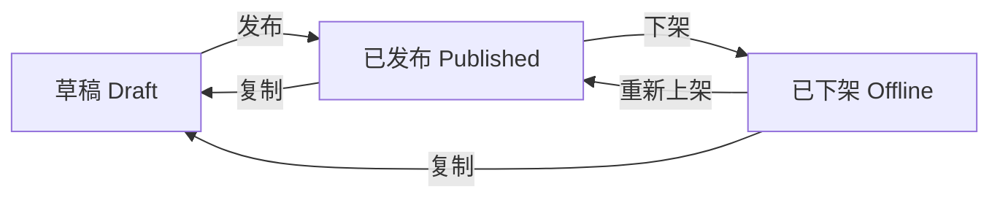

# 问卷设计器 - 产品需求文档 (PRD)

| 文档版本 | V1.0 |
| :--- | :--- |
| **最后更新** | 2026-01-21 |
| **状态** | 正式版 |
| **适用角色** | 运营管理员、研发工程师、测试工程师 |

---

## 1. 产品概述

### 1.1 背景与价值
平台需要收集用户的非量化主观数据（如生活习惯、主观感受、偏好等），这些数据无法通过体测设备直接获取。
**问卷设计器**是一个可视化工具，允许运营人员快速创建、发布问卷。其核心价值在于**“业务标签化”**——将用户的每一个回答，自动转化为用户画像中的一个标签，直接赋能给推荐算法。

### 1.2 核心用户故事 (User Story)
> **作为** 运营管理员，
> **我希望** 能通过简单的“添加题目-输入选项”的方式配置问卷，
> **并且** 不需要手动维护复杂的标签代码，系统能根据我的选项内容自动生成标签，
> **以便于** 我能快速上线“睡眠质量评估”等问卷，并立即在推荐系统中针对“失眠用户”配置推荐规则。

---

## 2. 核心业务逻辑

### 2.1 “所选即所得”的标签模型
这是本模块最核心的逻辑，旨在降低运营理解成本。

*   **传统模式**：配置题目 -> 配置选项 -> (繁琐)去另一个系统配置标签ID -> 回来绑定。
*   **本产品模式**：配置选项（如“侧卧”） -> 系统自动生成“侧卧”标签 -> 用户选择即被打标。

**数据流向**：
1.  **定义**：运营在问卷中定义 `选项 = 标签`。
2.  **采集**：C端用户选择选项。
3.  **沉淀**：系统将标签沉淀到【用户画像】和【元数据字典】。
4.  **应用**：【推荐策略】读取标签进行匹配。

### 2.2 状态机与生命周期
为保障线上数据安全，问卷采用严格的单向状态流转：

| 状态 | C端可见性 | 数据写入 | 允许操作 | 典型场景 |
| :--- | :--- | :--- | :--- | :--- |
| **草稿** | 不可见 | 无 | 任意编辑、删除 | 正在修改措辞、调整题目顺序 |
| **已发布** | **可见** | **持续写入** | **只读**、下架、复制 | 线上正常运行中 |
| **已下架** | 不可见 | 停止写入 | **只读**、删除(无数据时)、复制 | 问卷过时、发现错误需紧急撤回 |

---

## 3. 功能详细说明

### 3.1 问卷管理列表
**功能目标**：高效管理问卷资产。

*   **列表字段**：
    *   **问卷名称**：业务标识。
    *   **状态**：草稿/已发布/已下架（建议用不同颜色区分）。
    *   **关联标签数**：该问卷包含的标签总数（即所有选项之和）。
    *   **更新时间**。
*   **操作逻辑**：
    *   **新建**：点击创建空白草稿。
    *   **复制**：**高频功能**。点击复制生成“xxx_副本”，内容完全一致，状态为草稿。用于版本迭代。
    *   **删除**：
        *   仅“草稿”和“已下架”且“无用户答卷数据”的问卷可删除。
        *   **安全锁**：若问卷产生的标签已被推荐策略引用，禁止删除，提示引用位置。

### 3.2 问卷编辑器 (核心)
**功能目标**：所见即所得的配置体验。

#### A. 画布交互
*   **题目列表**：垂直流式布局，模拟手机端阅读顺序。
*   **快捷排序**：支持题目卡片上下移动。
*   **快捷删除**：支持删除题目（草稿状态下）。

#### B. 题目配置 (抽屉式面板)
*   **题干**：支持输入富文本（V1.0仅支持纯文本）。
*   **必填开关**：控制C端是否强制用户回答。
*   **选项配置（智能填充）**：
    *   **操作**：运营输入选项文案（如“每天喝咖啡”）。
    *   **反馈**：下方的“标签名称”输入框**自动同步**填充为“每天喝咖啡”。
    *   **修正**：运营可点击标签输入框进行修改（如改为“咖啡依赖”），修改后不再随选项文案变化。
    *   **校验**：同一个问卷内，标签名称不允许重复。

#### C. 支持题型
1.  **单选题**：互斥选项。用户获得 1 个标签。
2.  **多选题**：并集选项。用户获得 N 个标签。

#### D. 底部工具栏
*   **保存**：点击手动保存草稿（系统每隔一定时间也应自动保存）。
*   **预览**：弹窗模拟真实手机端渲染效果，支持点击交互。
*   **发布**：触发[发布校验规则](#4-发布校验规则)。

---

## 4. 发布校验规则 (QA验收标准)

点击“发布”时，系统必须按顺序执行以下检查，任一失败则阻断发布并报错：

1.  **完整性检查**：
    *   问卷名称不能为空。
    *   题目数量 ≥ 1。
    *   每个题目选项数量 ≥ 2。
2.  **标签合法性检查**：
    *   所有选项必须配置标签名称（不能为空）。
    *   **唯一性**：同一问卷内，所有选项的标签名称**不可重复**。（例如：题目1有“失眠”选项，题目2就不能再有“失眠”选项，否则推荐系统无法区分来源）。
3.  **冲突检查**：
    *   系统内是否已存在同名且“已发布”的问卷。

---

## 5. C端交互体验规范

*   **入口**：体测流程结束后，或个人中心页。
*   **渲染**：
    *   单选：圆形选中框。
    *   多选：方形选中框。
    *   必填项：标题红星标记。
*   **提交反馈**：
    *   提交成功后，Toast 提示“感谢您的反馈”。
    *   若提交失败（网络原因），支持原页重试。
*   **防重复提交**：
    *   同一用户在同一业务周期（如一次体测）内，仅允许提交一次。
    *   再次进入显示“您已完成作答”。

---

## 6. 数据埋点与统计 (V1.1规划)
*(V1.0 暂不需前端展示，但后端需记录)*
*   **问卷曝光量 (PV/UV)**。
*   **完卷率**：提交人数 / 进入人数。
*   **选项分布**：每个选项被选中的占比（用于优化推荐策略）。
